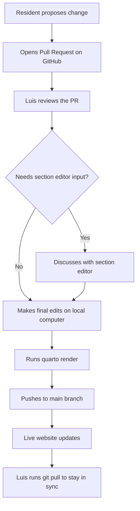

# UF Neurology Resident Handbook

## Table of Contents

- [Project Overview](#project-overview)
- [How This Site Is Built with Quarto](#how-this-site-is-built-with-quarto)
- [Core Files](#core-files)
- [Repository Structure](#repository-structure)
- [Local Development and Editing](#local-development-and-editing)
- [How This Site Is Hosted on GitHub](#how-this-site-is-hosted-on-github)
- [Recommended Workflow](#recommended-workflow)
- [Contributing](#contributing)

## Project Overview

This repository contains the source code for the UF Neurology Resident Handbook, a practical living document written by and for neurology residents.  

It is deliberately designed as a living document. Content is expected to change as evidence updates, institutional protocols evolve.

## How This Site Is Built

The site is built with Quarto, a tool that turns simple text files into a clean, searchable website.

Currently the Quarto files are rendered on a computer running RStudio. Those files are then mirrored in this GitHub repository. GitHub takes the finished files and publishes them on the internet as a regular website (HTML pages).

GitHub also makes it easy for anyone to suggest improvements or corrections by opening a pull request. You make your edits on GitHub in a separate copy of the source file, then the pull request is sent to the root administrator, who will review them. If the changes look good, the root administrator merges them into the main handbook.

Luis Silva is the current root administrator. He maintains the master files on his local computer and edits them using RStudio, the environment he is most familiar with. Quarto also supports Python and Julia, so future administrators can work in the language they prefer.

Invitations for section editors have been sent. The current editorial team is listed below.

| Section                        | Editor          |
|--------------------------------|-----------------|
| **Editor in Chief**            | Dr. Wilson      |
| Neurological Examination       | TBD             |
| Vascular                       | TBD             |
| Neurocritical Care             | Dr. Maciel      |
| Epilepsy                       | TBD             |
| Neuromuscular                  | TBD             |
| Neuroimmunology                | TBD             |
| Neurotology                    | TBD             |
| Headache                       | TBD             |
| Emergencies                    | Dr. da Silva    |
| Procedures (Lumbar Puncture)   | TBD             |
| **New Sections**               |                 |
| Movement Disorders             | Dr. Almeida     |
| Sleep                          | TBD             |
| Neuro-ophthalmology            | TBD             |
| Behavioral Neurology           | TBD             |

## How to contribute

ANYONE can contribute to the handbook. To do this you only need a free GitHub account.  

After that, you can edit the file directly in your browser, make your changes, and then submit a 'pull request'. The root administrator will review the suggestion and, if everything looks good, merge it into the main handbook.  

### Workflow Chart

## Repository Structure

The repository is deliberately simple. Source pages are kept in the `qmd/` directory; images are kept in `images/`. 
The `_quarto.yml` file controls site-wide settings such as the navigation menus and the output directory. 

## Core Files

| File / Folder       | Purpose |
|---------------------|---------|
| `_quarto.yml`       | Project configuration (navbar, theme, output directory, search, repo links) |
| `styles.css`        | Custom CSS that gives the site its distinctive look (hero boxes, code blocks, mobile tweaks) |
| `index.qmd`         | Homepage |
| `about.qmd`         | About page |
| `qmd/`              | All clinical content organized by topic |
| `images/`           | Figures, CT examples, etc. |
| `docs/`             | Generated website (this is what GitHub Pages serves) |

