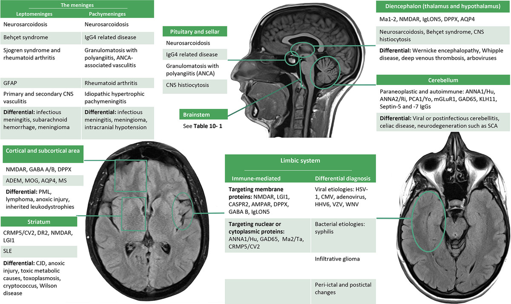

## Initial Work-up

-   Order **MRI brain with contrast**
-   CSF: basic studies, OCB, cytokine panel, flow cytometry, cytology, infectious PCR
-   If suspicious for HSV → send **two** tests and treat empirically with acyclovir until both tests are negative

## Does it meet Graus criteria for autoimmune encephalitis?

1.  Subacute onset (\< 3 months) of memory deficits, altered mental status, or psychiatric symptoms

2. One or more of the following:

    -   New focal CNS deficits

    -   Unexplained seizures

    -   CSF pleocytosis

    -   MRI findings suggestive of encephalitis

    AND Reasonable exclusion of alternative disorders

## Serum or CSF?

**Short answer: both.**

### Which panel to choose?

-   When in doubt, order **MDC2 and MDS2** --- these are the most complete panels.\
    They contain the same antibodies as ENS2/ENC2 **plus Kelch-11**.\
    (Kelch-11 often presents as a brainstem syndrome but can also cause limbic encephalitis, so it is best to send all antibodies.)

::: callout-important
**Is that enough? NO.**

-   **Ma2** can present with limbic encephalitis and is **not** on any panel. It must be ordered separately (Mayo, Quest, or Athena).
-   **MOGAD** can present as ADEM, cortical encephalitis, or undifferentiated meningoencephalitis and is **not** included in MDC2/MDS2 or ENC2/ENS2.\
    → Always add **CDS1** (to test for MOG-IgG).
:::

### If diencephalic, brainstem, or cerebellar syndrome

Order:

-   **MDC2 / MDS2**
-   **CDS1**
-   **Ma2** (must be ordered separately)

::: callout-warning
**ENC2 / ENS2 alone is not enough** for these syndromes.\
You **must** order MDS2/MDC2; otherwise you will miss many antibodies not tested on the encephalopathy panel.
:::

*See the Mayo anatomical map in the team rooms to guide which antibodies cause different syndromes.*

## Things to Know About Antibodies

-   **GAD65** --- very commonly false positive.\
    Must be **\> 20 nmol/L** to be clinically significant.\
    Values 0.03 -- \< 20 nmol/L are false positive.\
    (If reported in IU, the significant threshold is 10 000.)

-   **Low-titer MOGAD** (1:20 -- 1:40) that does **not** meet Banwell criteria is usually a false positive.\
    If it looks like MS → it is MS.

-   **NMDA+ in serum but negative in CSF** → rethink whether the patient truly has the syndrome.

### Preferred specimen by antibody

| Better in **Serum**                      | Better in **CSF** |
|------------------------------------------|-------------------|
| AQP4, MOG, CASPR2, LGI-1, Myasthenia Abs | NMDA, GFAP        |

## Treatment of Autoimmune Encephalitis

If high suspicion (meets criteria):

-   Treat with **IVMP + PLEX**
-   Give **rituximab 1 g once** after PLEX
-   Obtain **CT CAP** + testicular / ovarian ultrasound

## Quick Antibody Associations

-   **NMDA & AMPA** → psychiatric symptoms + limbic encephalitis
-   **PCA-1 / Anti-Yo** → cerebellar degeneration + ovarian cancer
-   **LGI-1** → faciobrachial dystonic seizures / hyponatremia
-   **LGI-1 / CASPR2 / GABAb** → seizures (usually temporal lobe), rapidly progressive dementia
-   **GAD65** → refractory epilepsy, cerebellar ataxia, autoimmune encephalitis, stiff-person syndrome
-   **ANNA-1 / Anti-Hu** → can cause almost anything, including a neuronopathy with complete sensory loss

## Neurosarcoidosis

Can present as:

-   Parenchymal lesions
-   Leptomeningitis / pachymeningitis
-   "Meningioma-like" lesions
-   Diencephalic presentation
-   Pituitary / sellar involvement
-   Myelitis (trident sign, pial enhancement)

**Work-up / Treatment**

-   Get **CT CAP**
-   Obtain tissue for biopsy if possible
-   After biopsy (or empirically if high suspicion): **IVMP 1 g × 3--5 days** (or oral equivalent) + prolonged steroid taper
-   If diagnosis is confirmed while inpatient → consider starting **infliximab**

{fig-align="center"}
