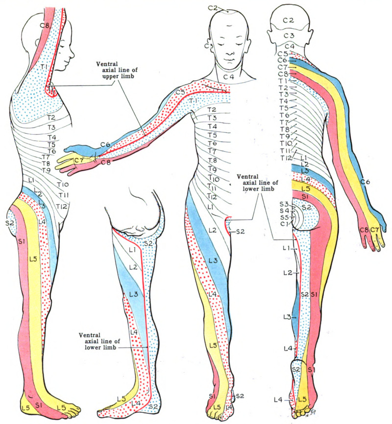

## Primary Sensory Modalities

| Modality           | Pathway                       | Test                                                                       |
|--------------|-----------------|---------------------------------|
| **Pain**           | Anterolateral (Spinothalamic) | Use safety pin or broken wooden tongue depressor                           |
| **Temperature**    | Anterolateral (Spinothalamic) | Hot/cold tuning fork or test tubes                                         |
| **Light Touch**    | Both pathways                 | Cotton wisp or finger touch                                                |
| **Vibration**      | Dorsal Columns                | 128 Hz tuning fork on bony prominences                                     |
| **Proprioception** | Dorsal Columns                | Joint position sense (big toe, fingers) --- "up or down?" with eyes closed |
| **Romberg Test**   | Dorsal Columns + Vestibular   | Stand feet together, eyes closed × 30 seconds                              |

## Cortical Sensory Signs

Test only if primary modalities are intact.

-   **Graphesthesia**: cannot recognize numbers or letters when drawn on skin
-   **Stereognosis**: Inability to recognize objects in hand
-   **Two-point discrimination**

### Neglect Syndromes

-   **Visual neglect**: Ignores one visual field (blink to threat intact)
-   **Tactile/sensory neglect**: Ignores stimuli on one side of body; does not regard that body area
-   **Line bisection, target cancellation, drawing tests** --- useful bedside screens

::: callout-tip
Always compare **right vs left** and **proximal vs distal**.

A clear **sensory level suggests spinal cord pathology**.
:::

