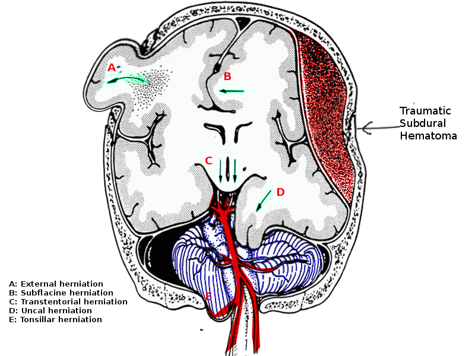

# Acute elevations in ICP and management of elevated ICP:

## Sx of elevated ICP include:

### Non-focal:

-   Agitation
-   Headache
-   Diminished level of consciousness
-   N/V
-   hiccups
-   increased yawning
-   Cushing's response (elevated BP, bradycardia, respiratory depression)

## If any concern for worsening or impending herniation:

Clinical suspicion of sustained (\>5 min) or elevation of ICP \> 22 mmHg - Neurocritical care fellow: 352-745-1912 - Ensure appropriate vascular access, consider need for additional PIV and/or stat central line, transfer to ICU if on floor/IMC

# Herniation syndromes

[{width="683"}](https://mdsearchlight.com/neurology/brain-herniation/)

| Syndrome                     | Findings                                                                                                                                                                                                                                                                                                                                                                                                                                                         |
|------------------------------------|------------------------------------|
| Subfalcine                   | \- Infarct in distal ACA territory → ipsilateral cingulate gyrus migrates under anterior falx - → ipsilateral leg weakness                                                                                                                                                                                                                                                                                                                                    |
| Central                      | \- Ascending: compression of PCA and SCA against tentorium - Descending: progression of abnormal flexor posturing to extensor posturing → impending death due to damaged respiratory and cardiac centers in medulla by herniated cerebellar tonsils through foramen magnum                                                                                                                                                                                    |
| Cerebellar tonsillar         | \- PICA, vertebral artery, anterior spinal artery infarcts → infarct to brainstem, tonsils, and lower cerebellum, upper cervical cord → respiratory arrest, downbeat nystagmus                                                                                                                                                                                                                                                                                   |
| Uncal                        | \- Compression of 3rd nerve against tentorial edge → constriction followed by ipsilateral pupillary dilation - Compression of calcarine branch of PCA → infarct in temporal or occipital lobe - Compression of sylvian aqueduct → obstructive hydrocephalus - Midbrain displacement can cause compression on contralateral cerebral peduncle / contralateral corticospinal tract → ipsilateral hemiparesis to compression (Kernohan's notch phenomenon) |
| Transalar (trans-sphenoidal) | \- Descending / posterior variant: infarct in MCA territory from compression within sphenoid ridge - Ascending / anterior variant: infarct in anterior and middle cerebral arteries from compression of supra-clinoid segment of ICA against anterior clinoid process                                                                                                                                                                                         |
| Transcalvarial               | \- Often after decompressive hemicraniectomy → compression of cortical vessels along bony margin predisposing to hemorrhagic infarct                                                                                                                                                                                                                                                                                                                             |

# Management of herniation

| Tier              | Management                                                                                                                                                                                                                                                                                                                                                                                                                                                                                                                                                             |
|------------------------------------|------------------------------------|
| Tier 0 (Standard) | \- Assess ABCs - Minimize noxious stimuli (treat subclinical seizures, glucose control, treat shivering) - Analgesia / sedation (control pain and agitation at the lowest effective doses (fentanyl, lorazepam, propofol) - Target normothermia - Head of bed ≥ 30° (unless unstable MAP or brain sag) - Neck midline (optimize jugular venous drainage) - Iso or hyperosmotic fluids (NO D5W, ½ NS, etc) - Avoid and correct hyponatremia - Steroids in select conditions (brain tumor, abscess, non-infectious neuroinflammatory conditions) |
| Tier 1            | \- Hyperosmolar therapy - Temporary hyperventilation to a PaCO2 of 30-35 mmHg, consider 10 cc 1% lidocaine into ETT prior to suctioning - CSF drainage - Consider surgical decompression                                                                                                                                                                                                                                                                                                                                                                      |
| Tier 2            | \- Hyperosmolar therapy for higher Na goals - Optimize sedation and analgesia - Rescue decompressive surgery should be considered as a life-saving intervention                                                                                                                                                                                                                                                                                                                                                                                                  |
| Tier 3            | \- Sedation titrated to ICP goal or burst suppression of cEEG (pentobarbital coma) - Hyperventilation to achieve mild to moderate hypocapnia (PaCO2 25-34 mmHg), short lived, \<24 hours, works by ↑ vasoconstriction and ↓ cerebral blood volume. Effects at the expense of ↓ CBF therefore used only as bridge to urgent surgical therapy. Not recommended for routine management. Can be bridge to OR in actively herniating patients - Moderate hypothermia (target core temperature 32-34°C)                                                                |

# Hyperosmolar therapy

| Therapy | Dosing | Adverse Reactions | Pearls |
|---|---|---|---|
| Mannitol (0.5-1 g/kg over 5-15 mins) | - Give 20% 1g/kg bolus; max 150g - Can be re-dosed every 4-6 hrs, consider re-dose if: &nbsp;&nbsp;&nbsp;&nbsp;- Posm <320 and ICP still >20 &nbsp;&nbsp;&nbsp;&nbsp;- Posm >320, calculate osmolar gap (measured Posm − [2 x plasma Na + Glc/18 + BUN/2.8]); if < 20 AND Na <160, give addition 1 g/kg - Repeat until ICP <20 or definitive therapy | - Rebound ICP elevation with abrupt discontinuation / repeat dosing - Acute kidney injury - Hypovolemia - Hypotension - Electrolyte imbalances | - Relative contraindications: renal failure/insufficiency - May be given via peripheral - Duration of effect 90 min – 6 hrs - Monitor trough osmolar gap (goal <20 mOsm/kg) - Maintain euvolemia – replete urine output cc for cc with normal saline |
| Hypertonic Saline | **Goals** - Target Na (q2-4h): 145-155 mmol/L - Target osmolarity (q4-12h): 300-320 mOsmol/L or higher as indicated  **Bolus dosing** - 2% or 3%: 250 ml over 30 min - 23.4%: 30 ml over 30 min q6h  **2% or 3% to maintain Na<155 or Posm<320** - Na should not rise >8-10 pts in 24 hrs - Normal saline (154 mmol/L) &nbsp;&nbsp;&nbsp;&nbsp;- Baseline hyponatremia (Na<131 mmol/L) - 2% gtt (342 mmol/L): monitor Na q2-4h &nbsp;&nbsp;&nbsp;&nbsp;- Mild-moderate edema or baseline sodium close to target (~140 and above; patient should NOT be hyponatremic (<130)) &nbsp;&nbsp;&nbsp;&nbsp;- Peripheral or central line &nbsp;&nbsp;&nbsp;&nbsp;- Initiation: 0.5-1 ml/kg/hr &nbsp;&nbsp;&nbsp;&nbsp;- Infusion rate not exceed 125 ml/hr  **3% gtt (513 mmol/L): monitor Na q2-4h** - Severe edema or baseline sodium far from target (131-140) - Central line - Initiation: 0.5 ml/kg/hr - Peripheral up to 48 hours at rate <50 cc/hr – discuss with NCC first - Rebound edema can occur on d/c, observe in ICU ~24 hours - Discontinuation: Decrease rate by 50% every 4-6 hours, once rate is 20 ml/hr, it can be stopped | - Pulmonary edema - Heart failure - Acute kidney injury - Coagulopathy - Hypernatremia - Metabolic acidosis - Thrombophlebitis - Osmotic demyelination syndrome with rapid correction | - Central access needed for >2% gtt or 23.4% bolus - Duration of effect 90 min–4 h - Avoid prolonged hypernatremia > 160 - Decrease chloride and increase acetate content if patients develop metabolic acidosis - Can be prepared as a 1:1 NaCl:NaAcetate solution if hyperchloremic metabolic acidosis - If persistent hypotension with bradycardia after bolus → norepi gtt - Have nurse repeat all Na samples with dramatic changes as they frequently are inaccurate - If too quick drop during discontinuation, restart previous solution at prior rate with/without a 25 – 50% decrease |