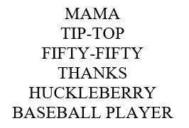
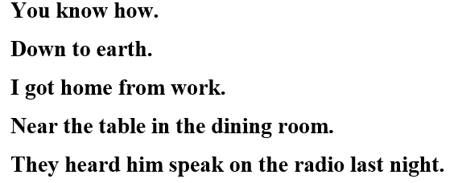
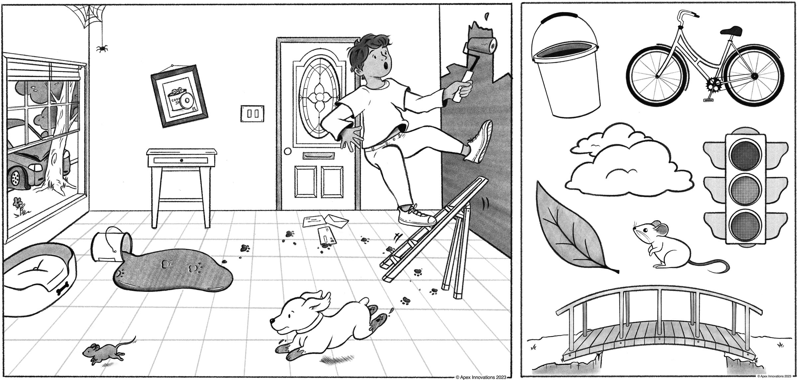

# NIH Stroke Scale

| Item                                                       | Scoring                                                                                                                                                                                                                                                                                |
|-----------------------------|-------------------------------------------|
| **1a. Level of Consciousness**                             | 0 = Alert; keenly responsive 1 = Not alert, but arousable by minor stimulation 2 = Not alert, requires repeated stimulation 3 = Responds only with reflex movements or less                                                                                                   |
| **1b. LOC Questions** Month & age                       | 0 = Answers both questions correctly 1 = Answers one question correctly 2 = Answers neither question correctly *aphasia/obtundation = 2, intubation only = 1*                                                                                                                 |
| **1c. LOC Commands** Open/close eyes Open/close grip | 0 = Performs both tasks correctly 1 = Performs one task correctly 2 = Performs neither task correctly                                                                                                                                                                            |
| **2. Best Gaze**                                           | 0 = Normal 1 = Partial gaze palsy 2 = Forced deviation, or total gaze paresis                                                                                                                                                                                                    |
| **3. Visual**                                              | 0 = No visual loss 1 = Partial hemianopia (even visual neglect) 2 = Complete hemianopia 3 = Bilateral hemianopia (blind incl. cortical blindness)                                                                                                                             |
| **4. Facial Palsy**                                        | 0 = Normal symmetrical movement 1 = Minor paralysis (asymmetry) 2 = Partial paralysis (lower face) 3 = Complete paralysis (upper and lower face)                                                                                                                              |
| **5. & 6. Motor Arm & Leg**                                | 0 = No drift, limb holds posture for full 10s 1 = Drift, limb holds posture, no drift to bed 2 = Some antigravity effort, cannot maintain posture, drifts down to bed 3 = No effort against gravity, limb falls 4 = No movement UN = amputation, surgical/burn concerns |
| **7. Limb Ataxia**                                         | 0 = Absent, cannot understand, profound weakness 1 = Present in one limb 2 = Present in two limbs                                                                                                                                                                                |
| **8. Sensory**                                             | 0 = Normal; no sensory loss 1 = Mild to moderate sensory loss 2 = Severe to total sensory loss                                                                                                                                                                                   |
| **9. Best Language**                                       | 0 = No aphasia, normal 1 = Mild to moderate aphasia 2 = Severe aphasia 3 = Mute, global aphasia (follows no commands + mute)                                                                                                                                                  |
| **10. Dysarthria**                                         | 0 = Normal 1 = Mild to moderate 2 = Severe, unintelligible or mute/anarthric UT = intubated, otherwise untestable                                                                                                                                                             |
| **11. Extinction/Neglect**                                 | 0 = No abnormality 1 = Extinction to bilateral simultaneous stimulation 2 = Profound neglect                                                                                                                                                                                     |

## Dysarthria

{fig-align="center"}

## Language

{fig-align="center"}

