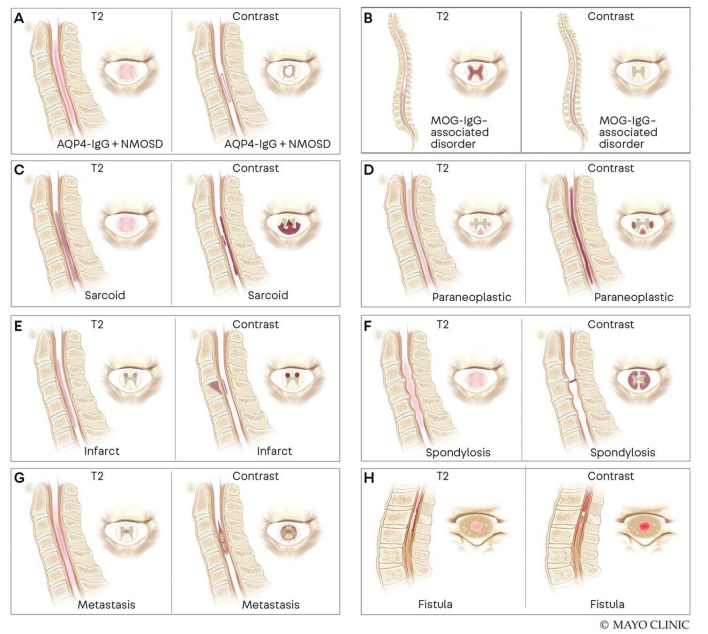

# History

**History is of utmost importance.**

- **Hyperacute** (within a few hours), especially after lifting a heavy object → think **vascular**
- Worsening over **hours to days** → think **autoimmune / infectious**
- Progressive over **weeks** → think **Dural AV Fistula**, compressive myelopathy, or neoplasia

# Approach

1. **MRI with gadolinium** → rule out compression (if compression present, call neurosurgery). Consider MRI brain to look for MS lesions.

2. If the lesion involves **> 3 segments**, it is considered **longitudinally extensive transverse myelitis (LETM)**. This changes the differential (MS usually causes short lesions) and includes:
   - Infection
   - NMO / AQP4
   - MOGAD
   - Sarcoidosis
   - Dural AV fistula (dAVF)

   **If LETM is present:**

   - Consider sending **MAS1 / MAC1** (contains all antibodies that cause myelopathies, including AQP4 and MOG) **or at least the CDS1 panel** (AQP4 / MOG)
   - Obtain CSF with basic chemistries + OCB / KFLC / MBP
   - If pleocytosis: add infectious PCR, cytology, **and flow cytometry** on top of the Mayo panels (MAS1/MAC1 or CDS1) + cytokine panel (serum and CSF)
     - In sarcoidosis, **IL-2R** is usually high (and often IL-6); this is a better test than serum or CSF ACE
   - Serologic testing should include: ANA, SSA/B, ANCA, HTLV-1, HIV-1, RPR, B12, folate, copper, serum cytokine 13 panel, MAS1 (or at least CDS1)
   - Additional ancillary testing: Chest CT (sarcoid), lip biopsy (Sjögren’s), brain/meningeal biopsy if indicate

- **AQP4**: LETM, whole-cord swelling, ring-enhancing appearance
- **MOGAD**: LETM, sometimes with the **H-sign** (gray matter involvement); similar to acute flaccid paralysis seen with arboviruses (JEV, EEE, WNV) and enterovirus. Lesions often disappear on follow-up
- **Sarcoidosis**: LETM, usually posterior enhancement, sometimes **trident sign**, sometimes only leptomeningeal enhancement
- **Paraneoplastic**: LETM but with a tractopathy pattern
- **Spinal cord stroke**: Owl’s eyes (anterior cord syndrome). Hyperacute; first MRI may be negative
- **Dural AV fistula**: LETM in the **thoracic** spine, progressive course, and presence of flow voids (sometimes no flow voids are visible). If suspicion is high → angiogram

# Neuromyelitis Optica Spectrum Disorder (NMOSD) — AQP4+ **Brain MRI not consistent with MS**

## Core Clinical Characteristics

1. Optic neuritis  
2. LETM  
3. Area postrema syndrome (intractable vomiting)  
4. Acute brainstem syndrome  
5. Acute diencephalic syndrome  
6. Acute cerebral syndrome  

## Additional MRI Requirements

- **For ON**: Optic nerve inflammation involving >½ of the optic nerve or chiasmatic lesion  
- **For myelitis**: Cord lesion > 3 segments; brain MRI not consistent with MS; AQP4-IgG positive (CDS1 panel)

## Diagnostic Rules

- **NMOSD with AQP4-IgG**: ≥ 1 core clinical characteristic **+** positive AQP4-IgG  
  - Specificity is near 100% → if AQP4 is positive, the patient has the disease  
  - Sensitivity ≈ 75% (can be false-negative early)  
  - Only ~15% of patients have +OCB

- **Seronegative NMOSD**: ≥ 2 core clinical events (at least one must be ON or LETM) + dissemination in space + applicable MRI requirements

### Treatment (Acute)

- **IVMP** → **PLEX 5–7 days** → **IVIg** if refractory (can be given concomitantly)

While inpatient after pheresis, consider:

- Rituximab 1000 mg once, **or**
- Inebilizumab (IL-19; now on formulary, requires form), **or**
- Satralizumab (IL-6), Ravulizumab (C5), Eculizumab (C5)

# MOGAD (Banwell Criteria)

**Brain MRI not consistent with MS**

1. **High titer** (1:100–1:1000) **+** ≥ 1 core event  
   Core events: optic neuritis, myelitis, ADEM, cerebral monofocal or polyfocal deficits, brainstem or cerebellar deficits, cerebral cortical encephalitis

2. **Low positive titer** (1:20 or 1:40), negative AQP4, **+** supporting MRI/clinical features, including:
   - Bilateral ON
   - Longitudinally extensive optic nerve involvement / perineuritis / optic disc edema
   - LETM
   - H-sign
   - Conus lesion
   - ADEM / deep gray involvement
   - Ill-defined brainstem, cerebellum, or cerebellar peduncle lesions
   - Cortical cerebral encephalitis ± leptomeningeal enhancement

Only ~15% of patients have +OCB.

### Treatment

- Acute: **IVMP ± PLEX / IVIg**
- MOGAD usually requires a **prolonged steroid taper**
- If recurrent → consider DMT: IVIg, CellCept + prednisone, Rituximab, or Tocilizumab

::: callout-tip
**Distinctive imaging features and patterns of enhancement** in myelopathies accompanied by longitudinally extensive T2 lesions.

The sagittal and axial images depict the typical lesion patterns on T2-weighted images (shown in light red) and postcontrast T1-weighted images (enhancement after contrast is shown in dark red). For each panel, the T2 sequences are shown on the left and postcontrast T1 sequences are shown on the right.
:::

::: {.panel-tabset}

## A — AQP4-NMOSD

**Aquaporin-4 (AQP4)-IgG–seropositive neuromyelitis optica spectrum disorder (NMOSD) myelitis** on sagittal cervical spine images typically reveals a solitary T2-hyperintense lesion that is central on axial sequences and extends over three or more vertebral segments, with contrast enhancement sometimes having a ringlike appearance.

## B — MOGAD

**Myelin oligodendrocyte glycoprotein (MOG)-IgG–associated disorder myelitis** on cervicothoracic cord images typically shows multifocal T2-hyperintense lesions with one or more longitudinally extensive T2 lesions and a predilection for the conus. The T2 lesions are generally central on axial sequences and in about one-third of patients will be restricted to the gray matter, forming an **H pattern**. Contrast enhancement is infrequent; if present, it is usually faint.

## C — Neurosarcoidosis

**Neurosarcoidosis myelitis** in the cervical spine shows a typical nonspecific longitudinally extensive T2-hyperintense lesion that is central on axial images. Postcontrast images show hallmark **linear dorsal subpial enhancement** with some accompanying central canal enhancement, with the combination forming an **axial trident sign**.

## D — Paraneoplastic

**Paraneoplastic myelopathy** in the cervical spine shows the typical longitudinally extensive T2 signal abnormality with a **tractopathy** on axial images confirmed by the presence of symmetric tract-specific T2 hyperintensity and enhancement restricted to the dorsal columns or lateral columns, or both.

## E — Spinal Cord Infarction

**Spinal cord infarction** in the anterior spinal artery territory reveals the typical **pencillike linear anterior cord** longitudinally extensive T2 hyperintensity with a partial linear strip of enhancement with contrast. On axial T2 and postcontrast images, the anterior horn cells are preferentially affected in an **owl-eye or snake-eye pattern**; occasionally (in approximately 10%), a vertebral body infarct can ensue.

## F — Spondylotic Myelopathy

**Cervical spondylotic myelopathy** with sagittal imaging showing spondylosis and a spindle-shaped T2 hyperintensity extending more than three vertebral segments, with a characteristic flat **pancakelike transverse band of enhancement** just below the site of maximum stenosis on postcontrast images. On axial images, the enhancement typically involves the white matter but spares the gray matter.

## G — Metastasis

**Intramedullary spinal cord metastasis** reveals a longitudinally extensive T2 hyperintensity with an enhancing intramedullary mass with the hallmark **thin rim of more intense enhancement (the rim sign)** accompanied by an ill-defined flame-shaped region of enhancement at its superior and inferior margins with a central dot (the **dot sign**) occasionally noted on postcontrast images.

## H — Spinal dAVF

**Spinal dural arteriovenous fistula** reveals the typical thoracic longitudinally extensive T2 hyperintensity extending to the conus with prominent flow voids and contrast enhancement and a characteristic **“missing piece” of enhancement** sometimes noted.

:::

{fig-align="center"}

::: callout-important
**ALWAYS look at both sagittal and axial images.**  
Many times you can tell the etiology from characteristic MRI features:
:::

